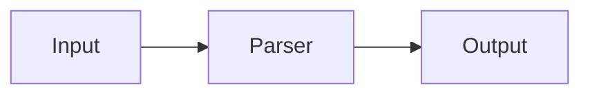

# Writing Slides

## File format

A slide deck is a single Markdown file named `DECK_NAME.md`. Slides are separated by `---`. Each slide opens with a frontmatter block declaring its template.

```markdown
---
template: title
---

# My Talk Title

## A concise subtitle

**Author Name**

---
template: content
---

## First Section

Key ideas:
- One idea per bullet
- Short phrases, not sentences
- Three to five bullets is plenty

---
template: closing
---

## Thank You

Questions welcome
```

Render it:

```bash
java -jar md-slides.jar render my-talk --theme dark
```

Output: `my-talk/index.html` (audience), `my-talk/speaker.html` (presenter), plus any copied assets.

## Templates

MD-Slides has six templates. Every slide must declare one.

### `title`

The opening slide. Use once, at the start.

```markdown
---
template: title
---

# Main Title

## Optional subtitle

**Optional author**
```

**Constraints:** H1 title ≤ 2 lines; H2 subtitle ≤ 2 lines; author ≤ 80 characters.

### `content`

The workhorse — most slides use this.

```markdown
---
template: content
---

## Slide Heading

Body: markdown, lists, code blocks, images, tables.
```

**Constraints:** heading ≤ 80 characters; body ≤ 12 lines, ≤ 150 words.

### `section-title`

Opens a new chapter. Parses like `content` but themes assign it a distinct visual identity — typically a full-bleed background.

```markdown
---
template: section-title
---

## Chapter Title

Subtitle or brief framing
```

### `two-column`

Splits a slide into two independent columns using `---column---` as the delimiter.

```markdown
---
template: two-column
---

## Heading

Left column: code, text, lists.

---column---

Right column: output, comparison, commentary.
```

**Constraints:** each column ≤ 10 lines, ≤ 75 words. The `---column---` delimiter must appear on its own line. Exactly one delimiter is required.

### `diagram`

Renders a Mermaid chart to SVG at build time. Requires `mmdc` (mermaid-cli) installed.

```markdown
---
template: diagram
caption: Optional caption below the chart
---

## Slide Heading


```

`mmdc` converts the Mermaid block to an embedded SVG — no client-side Mermaid.js needed.

### `closing`

The final slide. Parses like `content`; themes can apply full-bleed branding.

```markdown
---
template: closing
---

## Thank You

Questions welcome
```

**Constraints:** heading ≤ 80 characters; body ≤ 12 lines, ≤ 150 words.

## Per-slide frontmatter keys

Every slide opens with a frontmatter block. Available keys:

| Key | Required | Description |
|-----|----------|-------------|
| `template:` | yes | Slide type — see above |
| `header:` | no | Top bar text for this slide |
| `footer:` | no | Bottom bar text for this slide |
| `vertical-align:` | no | `top` · `center` (default) · `bottom` |
| `background:` | no | Per-slide background image path (overrides theme) |
| `caption:` | no | Caption below diagram (`diagram` template only) |

### Header and footer tokens

`header:` and `footer:` values support live tokens:

| Token | Resolves to |
|-------|-------------|
| `{{pageNumber}}` | Current slide number |
| `{{totalPages}}` | Total slide count |
| `{{timer}}` | Elapsed presentation time |
| `{{date}}` | Current date |

Example:

```markdown
---
template: content
header: My Talk — Slide {{pageNumber}} of {{totalPages}}
---
```

Per-slide `header:` / `footer:` overrides the theme default for that one slide. Set deck-wide headers in your theme JSON or project config.

## Content types

All standard CommonMark inline formatting works in any template:

```markdown
**Bold** · *Italic* · `inline code` · [link](url) · ~~strikethrough~~
```

**Code blocks** — fenced with a language name for syntax highlighting (190+ languages via highlight.js):

````markdown
```scala
case class Slide(id: SlideId, template: Template)
```
````

**Images** — path is relative to the `.md` source file; MD-Slides copies images to the output directory automatically:

```markdown

```

For self-contained files, use base64 data URLs: ``.

Alt text is required — missing alt text is a WCAG 2.1 validation error.

**Tables:**

```markdown
| Column A | Column B |
|----------|----------|
| value    | value    |
```

Column alignment: `|:---:|` center · `|---:|` right.

## Speaker notes

Add notes to any slide with an HTML comment — they appear only in speaker view:

```markdown
<!-- Speaker notes: Key point here. Don't forget to mention Y. -->
```

See [Speaker View](./speaker-view) for details.
