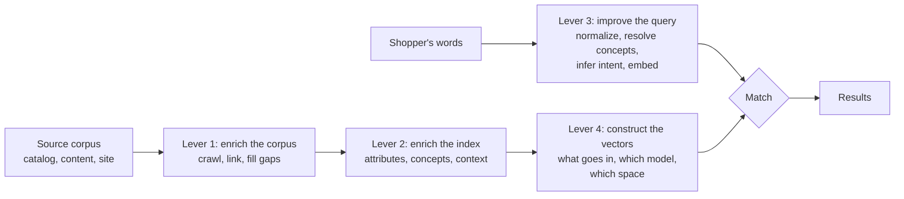

# Figure 1

```mermaid
flowchart LR
    Q["Shopper's words"] --> P["Lever 3: improve the query<br/>normalize, resolve concepts,<br/>infer intent, embed"]
    C["Source corpus<br/>catalog, content, site"] --> E1["Lever 1: enrich the corpus<br/>crawl, link, fill gaps"]
    E1 --> I["Lever 2: enrich the index<br/>attributes, concepts, context"]
    I --> V["Lever 4: construct the vectors<br/>what goes in, which model,<br/>which space"]
    P --> M{"Match"}
    V --> M
    M --> R["Results"]
```
