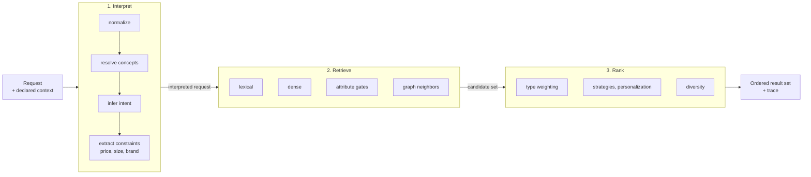

# Figure 2

```mermaid
flowchart LR
    RQ["Request<br/>+ declared context"] --> P1
    subgraph P1["1. Interpret"]
        direction TB
        N["normalize"] --> CX["resolve concepts"]
        CX --> IN["infer intent"]
        IN --> CO["extract constraints<br/>price, size, brand"]
    end
    P1 -->|"interpreted request"| P2
    subgraph P2["2. Retrieve"]
        direction TB
        LX["lexical"]
        DN["dense"]
        AT["attribute gates"]
        GR["graph neighbors"]
    end
    P2 -->|"candidate set"| P3
    subgraph P3["3. Rank"]
        direction TB
        IA["type weighting"]
        PS["strategies, personalization"]
        DV["diversity"]
    end
    P3 --> OUT["Ordered result set<br/>+ trace"]
```
