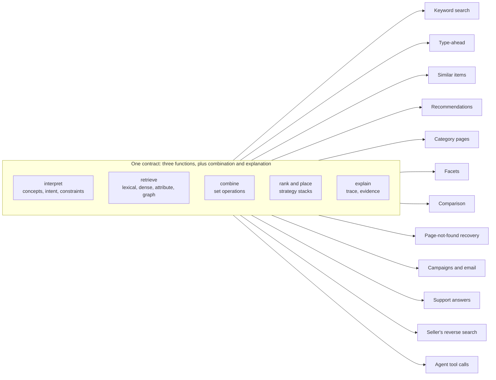

# Figure 3

```mermaid
flowchart LR
    subgraph PRIM["One contract: three functions, plus combination and explanation"]
        direction TB
        INT["interpret<br/>concepts, intent, constraints"]
        RET["retrieve<br/>lexical, dense, attribute, graph"]
        CMB["combine<br/>set operations"]
        RNK["rank and place<br/>strategy stacks"]
        EXP["explain<br/>trace, evidence"]
    end
    PRIM --> KS["Keyword search"]
    PRIM --> TA["Type-ahead"]
    PRIM --> SIM["Similar items"]
    PRIM --> RECS["Recommendations"]
    PRIM --> CAT["Category pages"]
    PRIM --> FAC["Facets"]
    PRIM --> CMP["Comparison"]
    PRIM --> NF["Page-not-found recovery"]
    PRIM --> CAMP["Campaigns and email"]
    PRIM --> SUP["Support answers"]
    PRIM --> REV["Seller's reverse search"]
    PRIM --> AGT["Agent tool calls"]
```
