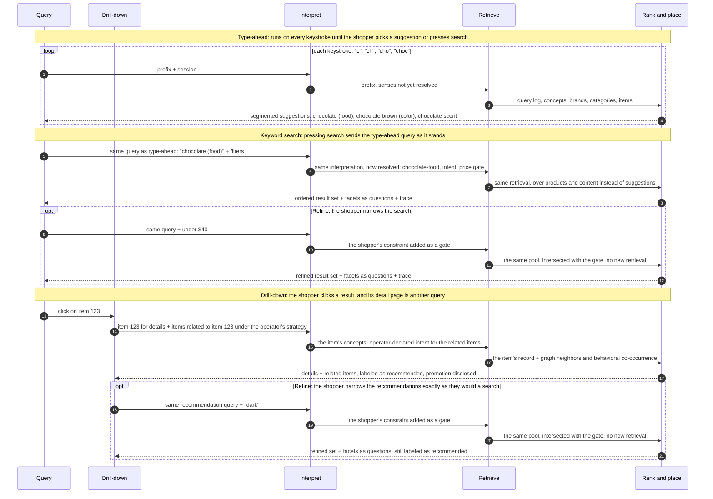

# Figure 4

```mermaid
sequenceDiagram
    autonumber
    participant Q as Query
    participant D as Drill-down
    participant I as Interpret
    participant R as Retrieve
    participant K as Rank and place
    Note over Q,K: Type-ahead: runs on every keystroke until the shopper picks a suggestion or presses search
    loop each keystroke: "c", "ch", "cho", "choc"
        Q->>I: prefix + session
        I->>R: prefix, senses not yet resolved
        R->>K: query log, concepts, brands, categories, items
        K-->>Q: segmented suggestions: chocolate (food), chocolate brown (color), chocolate scent
    end
    Note over Q,K: Keyword search: pressing search sends the type-ahead query as it stands
    Q->>I: same query as type-ahead: "chocolate (food)" + filters
    I->>R: same interpretation, now resolved: chocolate-food, intent, price gate
    R->>K: same retrieval, over products and content instead of suggestions
    K-->>Q: ordered result set + facets as questions + trace
    opt Refine: the shopper narrows the search
        Q->>I: same query + under $40
        I->>R: the shopper's constraint added as a gate
        R->>K: the same pool, intersected with the gate, no new retrieval
        K-->>Q: refined result set + facets as questions + trace
    end
    Note over Q,K: Drill-down: the shopper clicks a result, and its detail page is another query
    Q->>D: click on item 123
    D->>I: item 123 for details + items related to item 123 under the operator's strategy
    I->>R: the item's concepts, operator-declared intent for the related items
    R->>K: the item's record + graph neighbors and behavioral co-occurrence
    K-->>D: details + related items, labeled as recommended, promotion disclosed
    opt Refine: the shopper narrows the recommendations exactly as they would a search
        D->>I: same recommendation query + "dark"
        I->>R: the shopper's constraint added as a gate
        R->>K: the same pool, intersected with the gate, no new retrieval
        K-->>D: refined set + facets as questions, still labeled as recommended
    end
```
