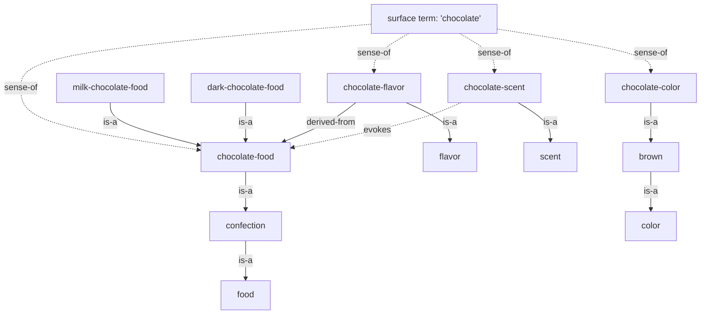

# Figure 5

```mermaid
flowchart TB
    W["surface term: 'chocolate'"]
    W -.->|sense-of| CF["chocolate-food"]
    W -.->|sense-of| CFL["chocolate-flavor"]
    W -.->|sense-of| CS["chocolate-scent"]
    W -.->|sense-of| CC["chocolate-color"]
    CF -->|is-a| CONF["confection"]
    CONF -->|is-a| FOOD["food"]
    MCF["milk-chocolate-food"] -->|is-a| CF
    DCF["dark-chocolate-food"] -->|is-a| CF
    CFL -->|is-a| FLAV["flavor"]
    CFL -->|derived-from| CF
    CS -->|is-a| SCENT["scent"]
    CS -.->|evokes| CF
    CC -->|is-a| BROWN["brown"]
    BROWN -->|is-a| COLOR["color"]
```
