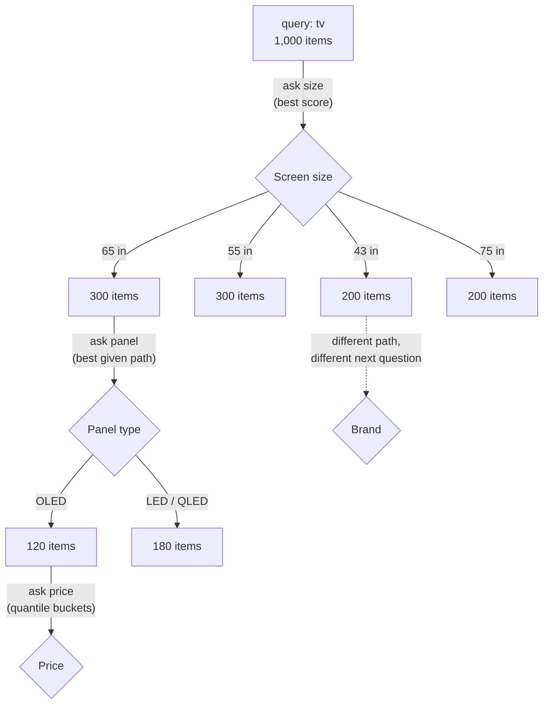

# Figure 6

```mermaid
flowchart TB
    R0["query: tv<br/>1,000 items"] -->|"ask size<br/>(best score)"| S{"Screen size"}
    S -->|"43 in"| R1["200 items"]
    S -->|"55 in"| R2["300 items"]
    S -->|"65 in"| R3["300 items"]
    S -->|"75 in"| R4["200 items"]
    R3 -->|"ask panel<br/>(best given path)"| P{"Panel type"}
    P -->|"OLED"| R5["120 items"]
    P -->|"LED / QLED"| R6["180 items"]
    R5 -->|"ask price<br/>(quantile buckets)"| PR{"Price"}
    R1 -.->|"different path,<br/>different next question"| B{"Brand"}
```
