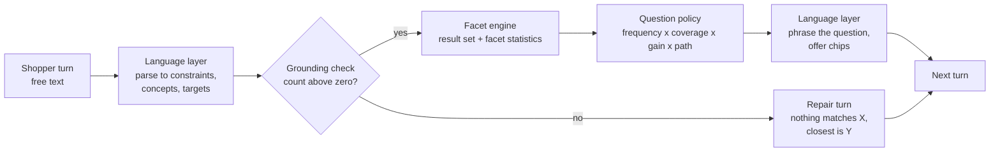

# Figure 7

```mermaid
flowchart LR
    U["Shopper turn<br/>free text"] --> LM["Language layer<br/>parse to constraints,<br/>concepts, targets"]
    LM --> GR{"Grounding check<br/>count above zero?"}
    GR -->|no| REP["Repair turn<br/>nothing matches X,<br/>closest is Y"]
    GR -->|yes| FS["Facet engine<br/>result set + facet statistics"]
    FS --> POL["Question policy<br/>frequency x coverage x gain x path"]
    POL --> LM2["Language layer<br/>phrase the question,<br/>offer chips"]
    LM2 --> U2["Next turn"]
    REP --> U2
```
