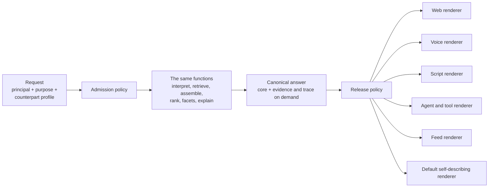

# Figure 8

```mermaid
flowchart LR
    REQ["Request<br/>principal + purpose +<br/>counterpart profile"] --> ADM["Admission policy"]
    ADM --> MATH["The same functions<br/>interpret, retrieve, assemble,<br/>rank, facets, explain"]
    MATH --> CA["Canonical answer<br/>core + evidence and trace on demand"]
    CA --> REL["Release policy"]
    REL --> RW["Web renderer"]
    REL --> RV["Voice renderer"]
    REL --> RR["Script renderer"]
    REL --> RA["Agent and tool renderer"]
    REL --> RF["Feed renderer"]
    REL --> RN["Default self-describing renderer"]
```
