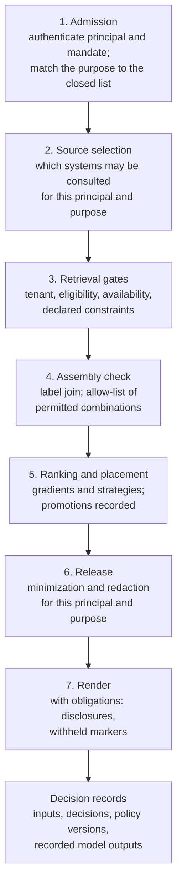

# Figure 9

```mermaid
flowchart TB
    A["1. Admission<br/>authenticate principal and mandate;<br/>match the purpose to the closed list"] --> S["2. Source selection<br/>which systems may be consulted<br/>for this principal and purpose"]
    S --> R["3. Retrieval gates<br/>tenant, eligibility, availability,<br/>declared constraints"]
    R --> C["4. Assembly check<br/>label join; allow-list of<br/>permitted combinations"]
    C --> K["5. Ranking and placement<br/>gradients and strategies;<br/>promotions recorded"]
    K --> L["6. Release<br/>minimization and redaction<br/>for this principal and purpose"]
    L --> V["7. Render<br/>with obligations: disclosures,<br/>withheld markers"]
    V --> T["Decision records<br/>inputs, decisions, policy versions,<br/>recorded model outputs"]
```
