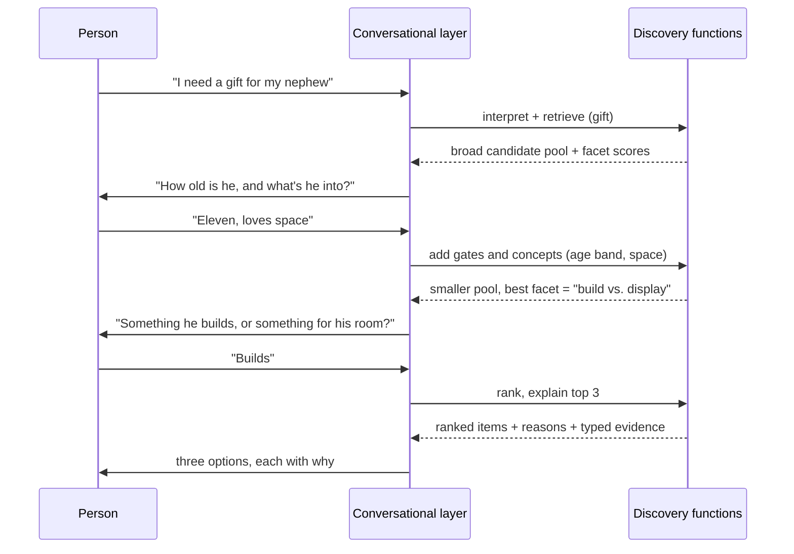

# Figure 10

```mermaid
sequenceDiagram
    participant P as Person
    participant C as Conversational layer
    participant D as Discovery functions
    P->>C: "I need a gift for my nephew"
    C->>D: interpret + retrieve (gift)
    D-->>C: broad candidate pool + facet scores
    C->>P: "How old is he, and what's he into?"
    P->>C: "Eleven, loves space"
    C->>D: add gates and concepts (age band, space)
    D-->>C: smaller pool, best facet = "build vs. display"
    C->>P: "Something he builds, or something for his room?"
    P->>C: "Builds"
    C->>D: rank, explain top 3
    D-->>C: ranked items + reasons + typed evidence
    C->>P: three options, each with why
```
