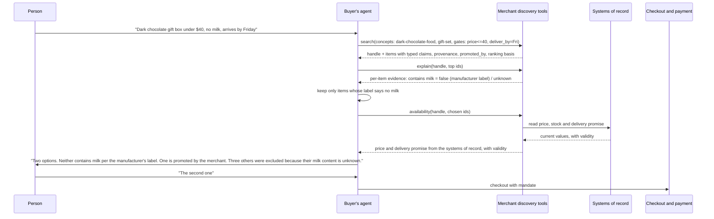

# Figure 11

```mermaid
sequenceDiagram
    participant H as Person
    participant AG as Buyer's agent
    participant T as Merchant discovery tools
    participant S as Systems of record
    participant K as Checkout and payment
    H->>AG: "Dark chocolate gift box under $40, no milk, arrives by Friday"
    AG->>T: search(concepts: dark-chocolate-food, gift-set, gates: price<=40, deliver_by=Fri)
    T-->>AG: handle + items with typed claims, provenance, promoted_by, ranking basis
    AG->>T: explain(handle, top ids)
    T-->>AG: per-item evidence: contains milk = false (manufacturer label) / unknown
    AG->>AG: keep only items whose label says no milk
    AG->>T: availability(handle, chosen ids)
    T->>S: read price, stock and delivery promise
    S-->>T: current values, with validity
    T-->>AG: price and delivery promise from the systems of record, with validity
    AG->>H: "Two options. Neither contains milk per the manufacturer's label. One is promoted by the merchant. Three others were excluded because their milk content is unknown."
    H->>AG: "The second one"
    AG->>K: checkout with mandate
```
